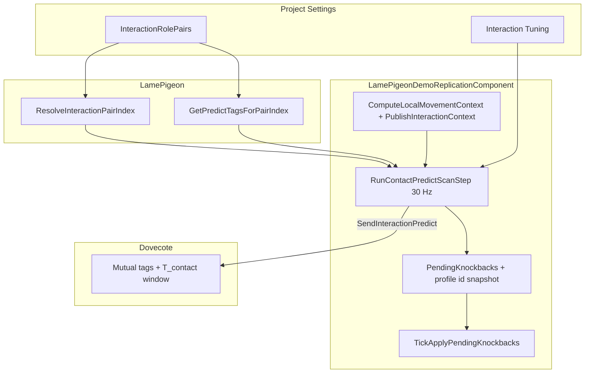

# Interaction prediction (PREDICT / REJECT, silent match)

## Scope

The relay matches **close player–player contacts** only (dash collision and any future pairs you add on the **client**). It does **not** model projectiles, abilities at range, or arbitrary RPC semantics. **`INTERACTION_CONFIRM` (0x0C) is deprecated:** Dovecote never sends it; Carrier **consumes and ignores** the packet (for old servers). The only client-visible server outcomes are **silent match** (no packet) and **`INTERACTION_REJECT`**.

## Server is pair-agnostic (tags + time only)

The relay **never** receives `InteractionProfileId` or the `InteractionRolePairs` table. It only sees UTF-8 tag strings and `deltaToContact`. Adding a new row in **Project Settings → LamePigeon → InteractionRolePairs** does **not** require server changes, as long as both clients agree on tags and timing.

## Architecture: Carrier vs UE plugin

- **`Carrier`** owns the wire protocol: connect, rooms, `SendInteractionPredict`, parsing legacy `INTERACTION_CONFIRM` (ignored) / `INTERACTION_REJECT`, `VAR_UPDATE`, RPC relay, and interpolation samples. Any **pure C++** game can link the standalone SDK copy and implement callbacks the same way.
- **`ULamePigeonSubsystem`** forwards to Carrier and exposes Blueprint delegates; it does not replace Carrier’s server logic. Use **`OnInteractionRejected`** for wire rejects (no confirm delegate).

## Flow

1. Each client sends `INTERACTION_PREDICT` (reliable) to **Dovecote** with: `eventId`, `otherPeerId`, `deltaToContact`, `myTag`, `theirTag` (UTF-8 strings). **Empty tags are invalid** — Dovecote drops such packets; clients should omit PREDICT entirely if they have no tag pair.
2. Server computes `T_contact = serverReceiveTime + deltaToContact` per record. **New PREDICT from the same `(sender, other)` replaces the previous unmatched row** for that direction (avoids stale rows when clients scan at 30 Hz).
3. Two records **match** if: same room, **crossed peers** (`A.sender == B.other` and `A.other == B.sender`), **all four tag strings non-empty** and **mutually consistent**: `A.myTag == B.theirTag && A.theirTag == B.myTag`, and `|T_A - T_B| <= InteractionConfirmWindowSeconds` (default **1.0** on the relay). There is **no whitelist** of role names on the server — only byte/string equality.
4. On match: **no packet** to clients (silent). Matched rows are retained until **TTL** (`InteractionEventTtlSeconds`).
5. Unmatched after `InteractionRejectAfterSeconds` → `INTERACTION_REJECT` to that sender for that `eventId`.

## For contributors: mapping pairs → gameplay (UE demo)

**Convention (stock demo table):**

| `InteractionRolePairs` index | `InteractionProfileId` (client) | When `ResolveInteractionPairIndex` returns it |
|-----------------------------|---------------------------------|-----------------------------------------------|
| **0** | `DashCollision` (asymmetric tags) | Either local or remote movement context is **Dash** |
| — | *(none)* | **Neither** side is Dash → returns **INDEX_NONE**; demo does not send victim PREDICT for walk–walk |

Replicated int **`LamePigeonInteractionCtx`**: `0 = Walk`, `1 = Dash`. Unknown legacy values are treated as Walk for pair resolution.

**Single prediction pipeline** (same latency path as dash — no second protocol):

**Code anchors:**

| Piece | Location |
|-------|----------|
| Pair table + interaction tuning | [`LamePigeonSettings.h`](../Source/LamePigeon/Public/LamePigeonSettings.h), [`LamePigeonSettings.cpp`](../Source/LamePigeon/Private/LamePigeonSettings.cpp) |
| Resolver | `ULamePigeonSettings::ResolveInteractionPairIndex` |
| 30 Hz scan, PREDICT send, pending rows | [`LamePigeonDemoReplicationComponent.cpp`](../../../Source/LamePigeonDemo/LamePigeonDemoReplicationComponent.cpp) |
| Apply (predicted knockback) | `TickApplyPendingKnockbacks` applies dash-style horizontal knockback + optional `NotifyVictimPredictedKnockbackContactAlign` proxy snap when a proxy actor exists |

**Adding a third pair (outline):**

1. Append a row to `InteractionRolePairs` with unique tags and optional `bSymmetric`.
2. Extend `ResolveInteractionPairIndex` (or replace with data-driven rules) so the new contexts map to that row index.
3. In `RunContactPredictScanStep`, add a geometry branch for that index (same wire path: `SendInteractionPredict` + `WireDeltaForGeometryTime`).
4. In `TickApplyPendingKnockbacks`, branch on `InteractionProfileId` (or pair index) for impulse / VFX / proxy snap if profiles differ.

## UE demo: 30 Hz contact scan and wire slack

- **[`ULamePigeonDemoReplicationComponent`](../../../Source/LamePigeonDemo/LamePigeonDemoReplicationComponent.h)** runs a fixed **~30 Hz** step (`InteractionPredictScanHz` in `LamePigeonDemoConstants.h`). It sends PREDICT **only when** geometry indicates imminent contact with a proxy peer within **`ContactPredictionScanRadiusCm`**. No “empty” PREDICT.
- **Dasher** PREDICT is emitted from that scan while **`bDashActive`** (uses `PendingDashPredictMyTag` / `PendingDashPredictTheirTag` from **`RequestKnockbackDash`** — if both tags are `NAME_None`, row **0** defaults are used). There is **no** separate burst of PREDICT on dash start.
- **Victim** PREDICT uses the same scan when not dashing and after sticky dash context ends. Geometry and tags use **`ResolveInteractionPairIndex`** (stock: only dash-involved → row 0); **the same** `deltaToContact` slack and rate limits apply when a pair is active.
- **`deltaToContact` on the wire** is `clamp(geometryTimeToHit + InteractionPredictWireSlackSeconds, …)` so the server’s `T_contact` is slightly later than the local geometry hit, giving time for **REJECT** to arrive before the local contact moment when tuning matches server `InteractionRejectAfterSeconds` and ping.

## UE: tags and dash API

- **`RequestKnockbackDash(FName MyTag, FName TheirTag)`**: starts the local dash and stores tags for the 30 Hz dasher PREDICT path. If both names are `NAME_None`, row **0** tags are filled from settings (same as before for defaults).
- **`InteractionRolePairs`**: stock default is **one** row — `DashCollision` (DASHSOURCE/DASHACCEPT, asymmetric). Add more rows for extra interaction types; extend `ResolveInteractionPairIndex` and the demo scan/apply branches accordingly. Index **0** must remain the dash-involved pair for `GetPredictTagsForPairIndex(0, …)` dasher defaults.
- Replicated int **`LamePigeonInteractionCtx`** (`0=Walk`, `1=Dash`): published from the local pawn so peers can call **`ResolveInteractionPairIndex(local, remote)`** and **`GetPredictTagsForPairIndex`**.

### Blueprint hooks (demo component)

- **`OnInteractionPredictCommitted`** — victim row created locally (PREDICT sent).
- **`OnInteractionPredictRejected`** — server REJECT for `yourEventId` (includes `OtherPeerId` when known from pending).
- **`OnInteractionPredictResolved`** — predicted knockback row cleared after apply (time / grounded heuristic).

**REJECT handling (demo):** if there is no matching pending row (already resolved), the packet is ignored (verbose log only). If knockback was **already applied** for that `eventId`, REJECT is treated as **stale** — row is removed **without** calling `OnInteractionPredictRejected` (avoids spurious Blueprint events after a successful hit).

**Debug:** Project Settings → **LamePigeon** → **Interaction|Debug** — enable **`bDrawInteractionPredictionDebug`** to draw contact scan radius, lines to peers inside range, dash sweep, hit marker, and knockback direction (lifetime **`InteractionDebugDrawLifetimeSeconds`**, default 10s). Predicted knockback debug line is orange. **Interaction|Tuning** exposes victim dash heuristics.

## Pure C++ client (no UE)

Use Carrier: `SendInteractionPredict(eventId, otherPeerId, delta, myTagUtf8, theirTagUtf8)` with the same mutual-tag convention. Subscribe to **`SetOnInteractionRejected`** only; ignore deprecated `INTERACTION_CONFIRM` on the wire.

## Relay timing vs UE settings

Numeric thresholds (**TTL**, **time window**, **reject after**) are authoritative on the relay. The matching fields on **`ULamePigeonSettings`** are for documentation and editor parity, so keep their meanings aligned when tuning.

## Dovecote console logs (`[Interaction]`)

| Message | Meaning |
|--------|---------|
| `PREDICT recv` | Accepted predict. |
| `PREDICT dropped` | Not in room, peer mismatch, or **empty tag**. |
| `match_skip` … **not mutually consistent** | Crossed peers but `my/their` strings don’t satisfy `A.my==B.their && A.their==B.my`. |
| `match_skip` … `|dT| > window` | Tags OK, contact times too far apart. |
| `MATCH` | Matched pair (silent — no confirm send). |
| `REJECT send` | Packet sent to peer. |
| `REJECT skipped` | Peer gone. |

---

## UE setup summary

**Project Settings → LamePigeon → Interaction → `InteractionRolePairs`**

- **Asymmetric (`bSymmetric = false`)**: the dasher supplies tags in `RequestKnockbackDash(RoleA, RoleB)`, while the victim sends the mirrored pair through `GetPredictTagsForPairIndex(0, true, …)`.
- **Symmetric** pairs make both peers send the same `(RoleA, RoleB)` pair, while the relay still validates mutual equality.

The relay does **not** keep a registry of allowed names. It only checks whether the two predictions are mutually consistent.

---

## Mapping gameplay events to tags

Binding tags directly to an RPC name such as `ApplyKnockback` is convenient as an editor hint, but it is not a reliable runtime trigger for victim prediction because victim-side `PREDICT` is emitted before the knockback RPC is processed.

The recommended model is a profile table in `ULamePigeonSettings`, where each row defines one interaction family.

The demo detects incoming dash pressure through proxy kinematics and movement context. New modes can extend that with replicated state flags and additional scan thresholds.
